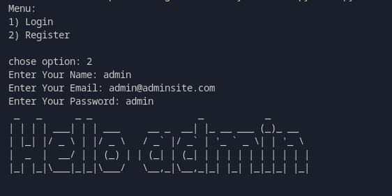

# Simple CLI (Menu-Driven) Registration System with Python

## Features:

- store data in file
- login
- register with unique mail
- validate email with regular expressions
- print user name as ASCII art with pyfiglet when logged

## Dependencies

- pyfiglet
- re

## Preview:

